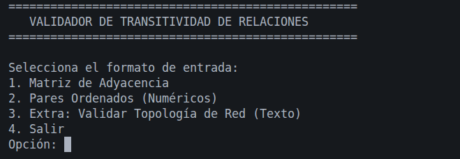

# Validador de Transitividad con Modulo extra de Enrutamiento de Redes

Aplicación de consola desarrollada en Java puro que evalúa si una relación binaria sobre un conjunto cumple con la propiedad transitiva matemática tanto como para conjutos de pares ordenandos y matricez . Además, incluye un módulo aplicado al mundo real para auditar topologías de red y validar enrutamientos de "Malla Completa" (Full Mesh).

## Características
* **Validación:** Evalúa conjuntos a través de matrices de adyacencia o pares ordenados numéricos.
* **Auditoría de Redes:** Permite ingresar enlaces de red mediante texto (ej. Direcciones IP o nombres de Routers) y detecta enlaces faltantes o fallas de ruteo.
* **Arquitectura Limpia:** Diseño modular por paquetes (Core, I/O, Model, Main) que separa la lógica matemática de la entrada de datos.

## Requisitos Previos
Para compilar y ejecutar este proyecto, solo necesitas tener instalado el **Java Development Kit (JDK) 17** o superior.

Puedes verificar si lo tienes instalado ejecutando en tu terminal:
```bash
java -version
javac -version
```
una vez comprobado que existe el **JDK** puede continuar con la instalacion.

## Instalacion y Descarga
* **Abre tu terminal.**
* **Clona este repositorio en tu máquina local usando Git (copia este comando y pegalo en tu terminal)**
```bash
  git clone https://github.com/ESPECTRO909/transitividad
```

* **Navega hacia la carpeta del proyecto descargado:**
```bash
cd transitividad/
```

## Compilación y Ejecución

Dado que mi proyecto utliza capas es estrictamente necesario compilar desde la carpeta **src**
  
* **Posiciónate en la carpeta src:**
```bash
cd src
```
* **copia el siguiente comando para compilar**
```bash
javac transitividad/main/Main.java
```
* **Ejecuta la aplicación (sin la extensión .java)**
```bash
java transitividad.main.Main
```

## Ejemplos de Uso
En este apartado no mostrare las pruebas realizadas (consultar el reporte.md), para este caso mostare un entrada que puede probar una vez haciendo los pasos previos y poder poner aprueba este programa.

Al iniciar la aplicación, se mostrará un menú interactivo.



### Ejemplo 1: Validación Matemática (Pares Ordenados)
Para probar la precisión del algoritmo matemático, seleccionaremos la **Opción 2**. Intentaremos engañar al programa dándole un camino incompleto para ver cómo detecta la falla.

Esperamos que falle y nos muestre un contra ejemplo dado que este conjunto **S** solo tiene dos elementos de pares ordenados
```bash
(0,1),(1,2)
```

Donde faltaria un par ordenando dado que se hizo la promesa que habria un camino de **0** a **2**
```bash
(0,2)
```


**1. Selecciona la opción 2 y el tamaño del conjunto ingresa un 3:**

imagen

**2 Copia y pega la siguiente línea:**
```bash
(0,1), (1,2)
```
**3 Salida Esperada:**

El programa detectará la falta del puente directo y mostrará el siguiente contraejemplo:

```bash
----------------- RESULTADO -----------------
 La relación NO es transitiva.
   -> Contraejemplo: Existen los pares (0, 1) y (1, 2), pero falta el par (0, 2).
---------------------------------------------
```
Tambien puedes hacer la prueba con un conjunto que si es transitivo

### Ejemplo 1.2: Validación Matemática (Caso de Éxito con Pares Ordenados)
Para contrastar, ingresaremos un conjunto que sí cumple perfectamente con la regla de transitividad, proporcionando tanto el camino inicial como el "atajo" que exige la regla matemática.

**1. Selecciona la opción 2 y el tamaño del conjunto ingresa un  3:**


**2. Copia y pega la siguiente línea de prueba:**

```bash
(0,1), (1,2), (0,2)
```

**3. Salida Esperada:**

El programa evaluará todas las combinaciones y, al detectar que la regla de "atajo" (0,2) está presente, confirmará la integridad del conjunto.
```bash
----------------- RESULTADO -----------------
La relación ES transitiva.
---------------------------------------------
```

Listo, le programa funciona a la perfeccion, puedes probar el siguiente caso de uso que es el modulo extra de redes,en ese modulo no es necesario utilizar numeros, acepta caracteres de tipo texto como nombres de maquina o router etc,

### Ejemplo 3: Validacion de Topologia de Red (Caso de Éxito)


**1. Selecciona la opcion 3**

**2. Copia y pega la siguiente línea de prueba:**
```bash
(RouterA, RouterB), (RouterB, SwitchCore), (RouterA, SwitchCore)
```

**3. Salida Esperada:**

El sistema traducirá dinámicamente los nombres de texto a una matriz numérica en segundo plano, evaluará los saltos de red y confirmará que la arquitectura está bien diseñada.
```bash
----------------- RESULTADO -----------------
La relación ES transitiva (La red está completamente enrutada / Full Mesh).
---------------------------------------------
```


## Arquitectura y Estructura del Proyecto
El sistema fue diseñado aplicando principios de separación de responsabilidades, organizando el código en los siguientes capas:

* /transitividad.main: Punto de entrada y gestión del menú interactivo.
* /transitividad.core: Motor matemático y evaluación de transitividad (`Verificador.java`), totalmente aislado de la lógica de interfaz, permite agregar nuevos modulos sin tocar el motor.
* /transitividad.io: Clases encargadas del parseo de datos de entrada con sus validaciones
* /transitividad.model:Clases de representacion `Resultado` y `Topologia` para el transporte seguro de la información entre capas.

## Tecnologías Utilizadas
* **Lenguaje:** Java 17
* **Paradigma:** Programación Orientada a Objetos.
  
## Mejoras planificadas
* **Persistencia de Datos:** Integración de un módulo de salida (`OutputWriter`) para generar logs históricos en archivos `.txt` con los resultados de las preubas.
* **Interfaz Gráfica / API:** Evolucionar el núcleo matemático para consumirlo a través de una API RESTful utilizando Spring Boot.

## Autor

* **Sinue Alvarez Cortez:** Desarrollador Backend | Estudiante de Ingeniería en Computación
* **GitHub:** [ESPECTRO909](https://github.com/ESPECTRO909)
* **LinkedIn:** [Sinue Alvarez](https://www.linkedin.com/in/sinue-alvarez)
