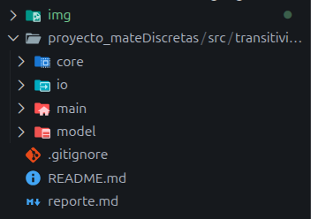
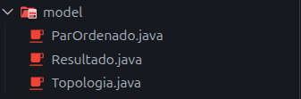
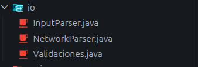

# Universidad Michoacana de San Nicolás de Hidalgo
### Programa de la carrera en Ingeneria en Computacion

* **Materia:** Matemáticas Discretas
* **Proyecto:** Reporte Técnico del programa Transitividad
* **Alumno:** Sinue Fernando Alvarez Cortez
* **Fecha:** 5 de Junio de 2026


## 1. Introducción
El presente reporte detalla el diseño, análisis matemático y desarrollo algorítmico de un validador de transitividad construido en Java. El objetivo central del software es evaluar relaciones binarias expresadas mediante pares ordenados o matrices de adyacencia, determinando rigurosamente si cumplen con la propiedad transitiva.

Como valor agregado y demostración práctica aplicada al área de sistemas y telecomunicaciones, el proyecto incorpora un módulo de auditoría de redes. Este submódulo traduce la regla matemática de la transitividad para evaluar topologías de red en el mundo real, validando la integridad de arquitecturas de "Malla Completa" (Full Mesh) a partir de direcciones IP o nombres de dispositivos.


## 2. Justificación Técnica y Práctica

El desarrollo de esta herramienta fue guiado por dos instrucciones principales: la eficiencia algorítmica y la aplicación práctica de la teoría matemática.

**Justificación de las Estructuras de Datos:**
A nivel técnico, se tomó la decisión arquitectónica de normalizar cualquier formato de entrada (ya sean pares ordenados o cadenas de texto) y convertirlo en una **Matriz de Adyacencia** bidimensional. La razón detrás de esta elección es la optimización del rendimiento. Si el programa operara evaluando listas dinámicas de pares, el tiempo de búsqueda para confirmar la existencia de un "puente" matemático sería costoso. En cambio, al utilizar una matriz, la validación de una conexión entre un nodo **i** y un nodo **j** se realiza mediante un acceso directo a la memoria con un tiempo constante de O(1).

**Motivación del Módulo de Redes:**
En lo personal, consideré vital no limitar este proyecto a la pura abstracción teórica. El módulo extra de auditoría de redes nace de mi necesidad de relacionar los temas vistos en la materia con casos de uso del mundo real.

En telecomunicaciones y arquitectura de redes, el concepto de un enrutamiento de "Malla Completa" (Full Mesh) es la representación física de la propiedad transitiva: si el *Router A* se comunica con el *Router B*, y el *Router B* se comunica con el *Switch C*, la red solo será óptima si existe un canal directo desde el *Router A* hasta el *Switch C*, incluyendo además las interfaces lógicas de retroalimentación (Loopbacks). Este módulo demuestra que la matemática discreta es el núcleo fundamental del diseño de infraestructuras tecnológicas.

Como parte del trabajo futuro y con el objetivo de consolidar mi crecimiento profesional en el desarrollo backend, se proyecta la evolución de este sistema hacia una arquitectura distribuida. Para las siguientes versiones se implementará la persistencia de datos utilizando una base de datos NoSQL. En paralelo, el motor de evaluación matemática se expondrá a través de una API RESTful, lo que permitirá enviar conjuntos de datos de forma remota y recibir resultados estandarizados, facilitando así su futura integración con interfaces gráficas.


## 3. Fundamentos Matemáticos

El motor lógico del programa **(Verificador.java)** se fundamenta en la evaluación estricta de la propiedad transitiva sobre un conjunto **A**. Matemáticamente, el algoritmo audita la siguiente premisa condicional:


```text
Para todo a, b, c en A, si (a, b) en R y (b, c) en R -> (a, c) en R
```

El sistema traduce esta regla abstracta iterando sobre la matriz de adyacencia. Si detecta el "camino de ida" y el "camino de continuación", exige obligatoriamente la existencia del "atajo" directo. Además, contempla las reglas de reflexividad inducida (Loopbacks), exigiendo la conexión **(a, a)** si detecta viajes de ida y vuelta entre dos nodos.

Tome en cuenta para el caso que no haya promesa y implique una prueba de vacuidad, si una relación no contiene ningún par ordenado (es un conjunto vacío), no tiene elementos que evaluar, como la condición de buscar pares (a, b) y (b, c) es imposible de cumplir, el antecedente siempre es falso, por lo tanto, la relación vacía siempre es transitiva por vacuidad en cualquier conjunto.


## 4. Decisión de Estructuras de Datos

Para el desarrollo del núcleo matemático del programa, se tomó la decisión arquitectónica de normalizar todas las entradas y procesarlas a través de una **Matriz de Adyacencia** bidimensional **(int[][])**. Esta elección se fundamenta en la eficiencia de los recursos y la velocidad de acceso a los datos.

* **Optimización de Búsqueda O(1):** Si se hubieran utilizado listas dinámicas para almacenar los pares ordenados, verificar la existencia de un "puente" matemático requeriría iterar sobre la lista completa, lo que costaría tiempo de procesamiento. Al usar una matriz, la validación de una conexión entre un nodo **A** y un nodo **C** se realiza consultando directamente sus coordenadas `matriz[A][C] == 1`. Este acceso directo a memoria opera en un tiempo constante de **O(1)**, maximizando el rendimiento del algoritmo.

* **Traducción y Normalización:** Para el módulo extra de enrutamiento de redes, las entradas no son números secuenciales, sino cadenas de texto (nombres de Routers, Switches o IPs). Para mantener el uso de la matriz de adyacencia sin alterar el motor lógico, se implementó una estructura `HashMap<String, Integer>`. Esta estructura actúa como un diccionario de traducción en tiempo real, asignando un índice numérico único a cada dispositivo de red, permitiendo que un problema de telecomunicaciones se evalúe con la misma eficiencia matemática pura.


## 5. Análisis de Complejidad (Notación Big O)

Para evaluar el rendimiento y la escalabilidad del algoritmo, se realizó el siguiente análisis de complejidad:

* **Complejidad Temporal O(n^3):** El núcleo matemático requiere evaluar todas las combinaciones posibles de tres elementos **(i, j, k)** para comprobar la regla de transitividad y los loopbacks. Esto se implementa mediante tres bucles **for** anidados que recorren la cardinalidad del conjunto **(n)**. Aunque el crecimiento es cúbico, el rendimiento es altamente eficiente para matrices y topologías de red convencionales, procesando las validaciones en fracciones de segundo.
* **Complejidad Espacial O(n^2):** El requerimiento principal de memoria del sistema está dictado por el almacenamiento de la matriz de adyacencia bidimensional de dimensiones n x n. Esta complejidad cuadrática asegura un consumo de RAM predecible, fijo y sumamente ligero, incluso con conjuntos de datos extensos.


## 6. Pruebas de Escritorio (Evidencias de Ejecución)

A continuación, se presentan los escenarios de prueba ejecutados para validar la robustez del algoritmo, incluyendo su capacidad para detectar fallos lógicos y su adaptabilidad a entornos de red reales.

### Prueba 1: Falla Lógica y Detección de Contraejemplo
* **Objetivo:** Demostrar que el motor matemático identifica correctamente cuando se rompe la regla de transitividad y es capaz de indicarle al usuario exactamente qué conexión (par ordenado) hace falta.
* **Entrada proporcionada:** `(0,1), (1,2)` (Tamaño del conjunto: 3)
* **Comportamiento del Código:** El siguiente fragmento de código es el encargado de evaluar esta condición y detonar el contraejemplo cuando detecta la ausencia del "puente":

```java
if (matriz[i][k] == 0) {
       return new Resultado(false, i, j, k);
       }
```
* **Evidencia de Ejecución:**
Como se observa en la siguiente captura, el programa procesa la entrada y devuelve el error esperado:


### Prueba 2: Validación Exitosa de Transitividad
* **Objetivo:** Comprobar que un conjunto que cumple estrictamente con las reglas de transitividad y loopbacks es aprobado por el sistema.

* **Entrada proporcionada:** **(0,1), (1,2), (0,2)** (Tamaño del conjunto: 3)

* **Comportamiento del Código:** El motor recorre la matriz de adyacencia y, al no encontrar ninguna violación a la regla matemática durante sus iteraciones, retorna un resultado positivo:

```java
return new Resultado(true);
```
* **Evidencia de Ejecución:**


### Prueba 3: Validación Exitosa de Transitividad compleja
* **Objetivo:** Comprobar que un conjunto mas grande cumple estrictamente con las reglas de transitividad y loopbacks es aprobado por el sistema.

* **Entrada proporcionada:** **(0,1), (1,2), (0,2)** (Tamaño del conjunto: 3)

* **Representacion grafica:**

  imagen del conjunto

* **Comportamiento del Código:** El motor recorre la matriz de adyacencia y, al no encontrar ninguna violación a la regla matemática durante sus iteraciones, retorna un resultado positivo:

```java
return new Resultado(true);
```
* **Evidencia de Ejecución:**


### Prueba 4: Auditoría de Redes (Malla Completa)
* **Objetivo:** Evidenciar la flexibilidad de las estructuras de datos al procesar cadenas de texto (nombres de dispositivos) en lugar de números, validando una topología de red real.

* **Entrada proporcionada:** (RouterA, RouterB), (RouterB, SwitchCore), (RouterA, SwitchCore)

* **Comportamiento del Código:** Para lograr esto, el módulo de red utiliza un HashMap que traduce dinámicamente los strings a índices numéricos antes de pasarlos al motor matemático:

* // [Sinue: Pega aquí el fragmento de tu NetworkParser.java (o la clase de I/O) donde usas el HashMap (put / get) para asignar un número a cada Router/Switch]

* **Evidencia de Ejecución:**
El sistema procesa los caracteres de texto, traduce la topología y confirma el enrutamiento exitoso:

### Prueba 5: Validación de Entradas y Manejo de Errores
* **Objetivo:** Demostrar la robustez de la capa de entrada/salida (`io`), asegurando que el sistema no colapse ante datos malformados, sino que intercepte el error y lo maneje de forma controlada.
* **Entrada proporcionada:** Ingreso de caracteres alfabéticos o sintaxis incompleta (ej. `(1,A)` o letras cuando se espera el tamaño de la matriz).
* **Comportamiento del Código:** La capa de lectura implementa validaciones o bloques `try-catch` para capturar excepciones como `InputMismatchException` o `NumberFormatException`. Al detectar un formato inválido, el sistema rechaza la entrada y solicita los datos nuevamente o muestra un mensaje de error amigable, protegiendo a la capa `core` de procesar "basura":

```java
// [Sinue: Pega aquí el bloque de tu código (seguramente en tu capa io o en tu Main) donde usas un try-catch, un if con expresiones regulares, o donde validas que el usuario no meta letras en lugar de números]
```


## 7. Arquitectura de Directorios

Para garantizar la escalabilidad, el mantenimiento y la correcta separación de responsabilidades, el proyecto sigue una estructura de directorios modular. Esta organización permite desacoplar el núcleo matemático puro de las lógicas de entrada, salida.



* **core/ (Núcleo de la Lógica):** Contiene la matemática pura. La clase Verificador opera de manera completamente agnóstica; su única responsabilidad es aplicar la teoría de grafos y relaciones discretas sobre las matrices proporcionadas, no conoce nada de tipos de uso, solo recibe los datos y los procesa independiente del uso que se le de.


* **model/ (Estructuras de Datos):** Define los objetos que transitan entre las diferentes capas de la aplicación. Encapsula las respuestas (como el objeto Resultado) para mantener un flujo de información estandarizado y seguro, asi como la persistencia de datos para en futuras versiones.


* **io/ (Input/Output):** Funciona como una capa de adaptación altamente extensible. Su diseño modular garantiza que el sistema pueda escalar fácilmente para recibir cualquier flujo de datos externos en el futuro —como lectura de archivos masivos, recepción de cargas JSON a través de la API RESTful proyectada, o eventos de una interfaz gráfica (GUI)— sin alterar una sola línea de código del motor matemático. Actualmente, se encarga de interceptar las entradas del usuario por consola, validar su integridad y estandarizarlas en estructuras que la capa `core` pueda procesar con seguridad.


* **main/:** Punto de arranque de la aplicación que inicializa e instancia las dependencias necesarias de las otras capas.
